# 🏥 Healthcare Microservices Architecture

> **Author:** Prahlad-7  
> A comprehensive guide for setting up and configuring a distributed healthcare management system

---

## 📋 Table of Contents

- [Overview](#overview)
- [System Architecture](#system-architecture)
- [Services](#services)
  - [Patient Service](#patient-service)
  - [Billing Service](#billing-service)
  - [Notification Service](#notification-service)
  - [Auth Service](#auth-service)
- [Infrastructure Components](#infrastructure-components)
- [Communication Patterns](#communication-patterns)
- [Getting Started](#getting-started)

---

## 🎯 Overview

This repository contains a microservices-based healthcare management system built with Spring Boot, featuring:

- **gRPC** for inter-service communication
- **Apache Kafka** for event-driven architecture
- **PostgreSQL** for persistent data storage
- **JWT-based authentication** for secure access control
- **Protocol Buffers** for efficient data serialization

---

## 🏛️ System Architecture

### High-Level Architecture Diagram

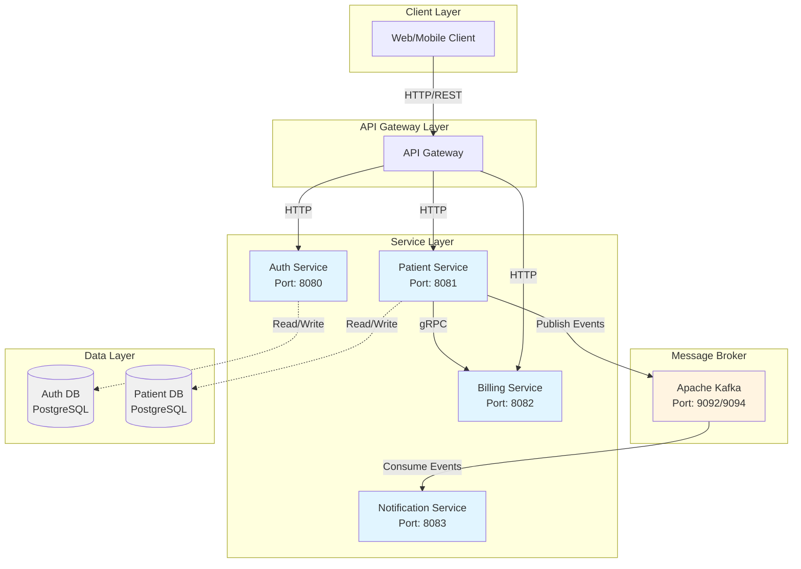

### Service Dependency Map

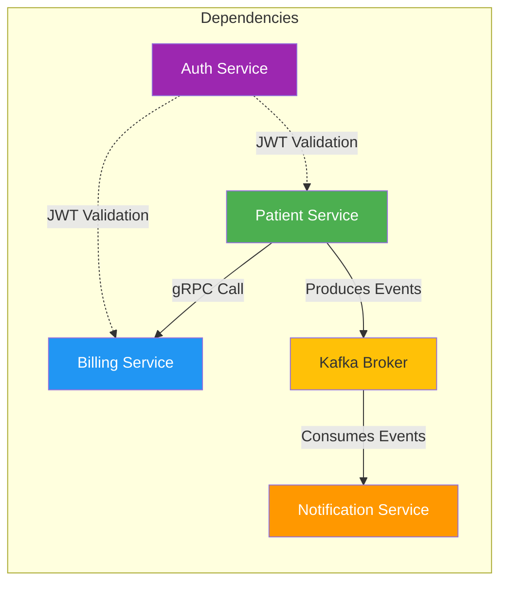

---

## 🔄 Communication Patterns

### Request-Response Pattern (gRPC)

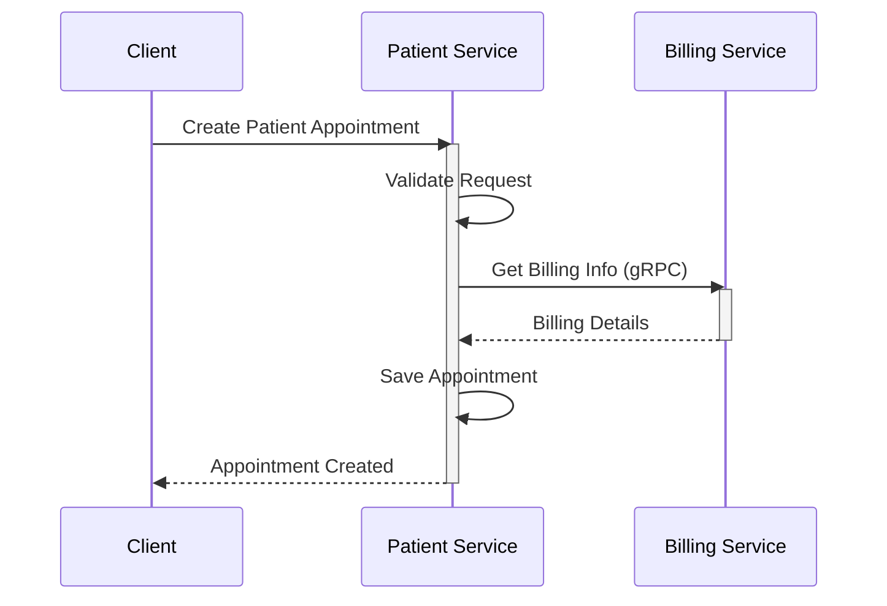

### Event-Driven Pattern (Kafka)

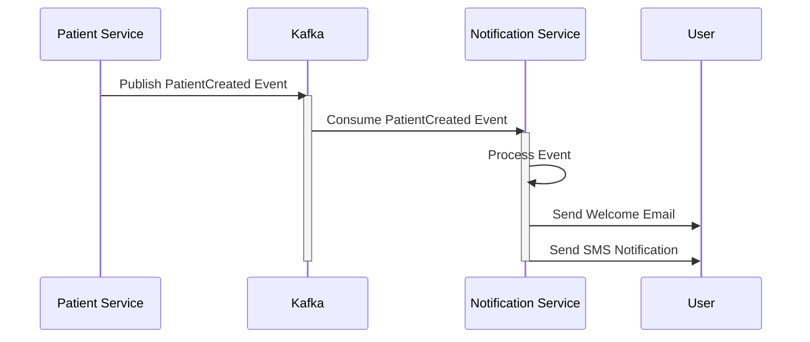

### Authentication Flow

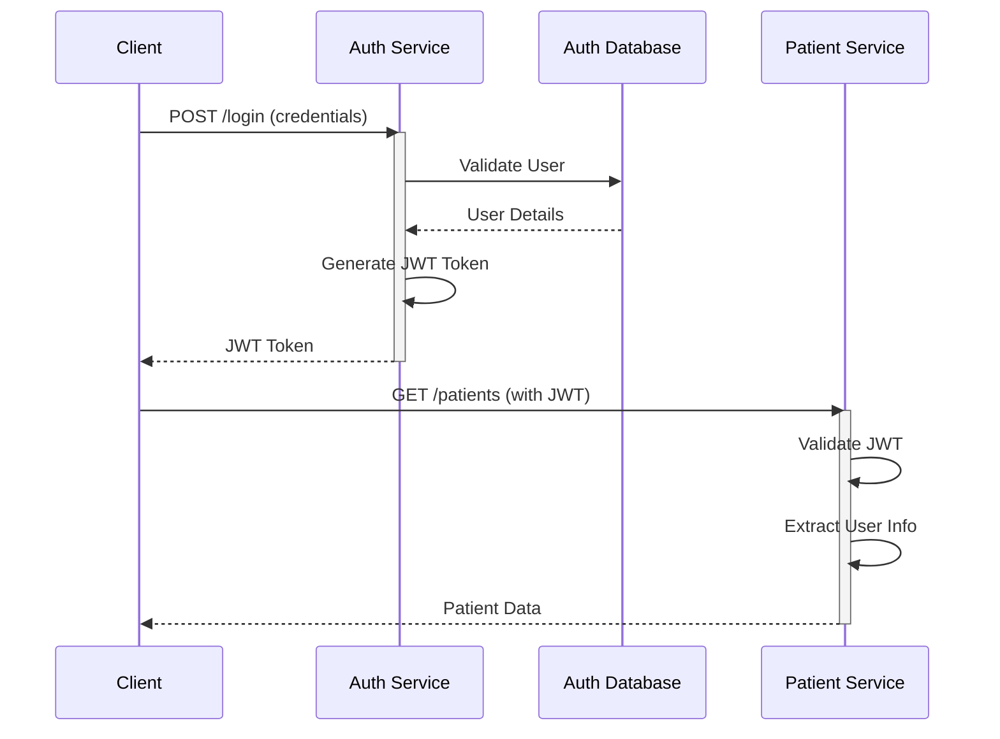

---

## 📊 Data Flow Diagram

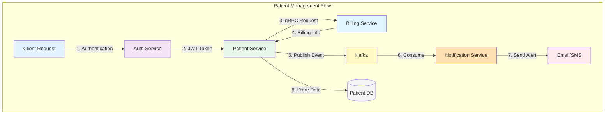

---

## 🚀 Services

### Patient Service

The Patient Service manages patient records and coordinates with other services through gRPC and Kafka.

#### Service Architecture

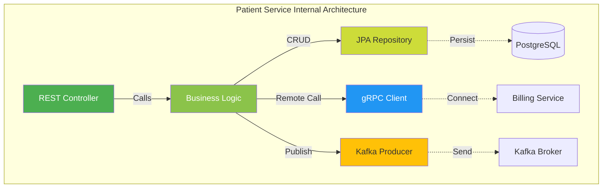

#### 📦 Environment Variables

```bash
# Database Configuration
SPRING_DATASOURCE_URL=jdbc:postgresql://patient-service-db:5432/db
SPRING_DATASOURCE_USERNAME=admin_user
SPRING_DATASOURCE_PASSWORD=password
SPRING_JPA_HIBERNATE_DDL_AUTO=update
SPRING_SQL_INIT_MODE=always

# gRPC Configuration
BILLING_SERVICE_ADDRESS=billing-service
BILLING_SERVICE_GRPC_PORT=9005

# Kafka Configuration
SPRING_KAFKA_BOOTSTRAP_SERVERS=kafka:9092

# Debug Configuration
JAVA_TOOL_OPTIONS=-agentlib:jdwp=transport=dt_socket,server=y,suspend=n,address=*:5005
```

#### 🔧 Maven Dependencies

Add these dependencies to your `pom.xml`:

```xml
<dependencies>
    <!-- gRPC Core -->
    <dependency>
        <groupId>io.grpc</groupId>
        <artifactId>grpc-netty-shaded</artifactId>
        <version>1.69.0</version>
    </dependency>
    <dependency>
        <groupId>io.grpc</groupId>
        <artifactId>grpc-protobuf</artifactId>
        <version>1.69.0</version>
    </dependency>
    <dependency>
        <groupId>io.grpc</groupId>
        <artifactId>grpc-stub</artifactId>
        <version>1.69.0</version>
    </dependency>
    
    <!-- Java 9+ Compatibility -->
    <dependency>
        <groupId>org.apache.tomcat</groupId>
        <artifactId>annotations-api</artifactId>
        <version>6.0.53</version>
        <scope>provided</scope>
    </dependency>
    
    <!-- Spring Boot gRPC Starter -->
    <dependency>
        <groupId>net.devh</groupId>
        <artifactId>grpc-spring-boot-starter</artifactId>
        <version>3.1.0.RELEASE</version>
    </dependency>
    
    <!-- Protocol Buffers -->
    <dependency>
        <groupId>com.google.protobuf</groupId>
        <artifactId>protobuf-java</artifactId>
        <version>4.29.1</version>
    </dependency>
</dependencies>
```

#### 🏗️ Build Configuration

```xml
<build>
    <extensions>
        <!-- OS-specific protoc compatibility -->
        <extension>
            <groupId>kr.motd.maven</groupId>
            <artifactId>os-maven-plugin</artifactId>
            <version>1.7.0</version>
        </extension>
    </extensions>
    
    <plugins>
        <!-- Spring Boot Plugin -->
        <plugin>
            <groupId>org.springframework.boot</groupId>
            <artifactId>spring-boot-maven-plugin</artifactId>
        </plugin>

        <!-- Protocol Buffers Compiler -->
        <plugin>
            <groupId>org.xolstice.maven.plugins</groupId>
            <artifactId>protobuf-maven-plugin</artifactId>
            <version>0.6.1</version>
            <configuration>
                <protocArtifact>com.google.protobuf:protoc:3.25.5:exe:${os.detected.classifier}</protocArtifact>
                <pluginId>grpc-java</pluginId>
                <pluginArtifact>io.grpc:protoc-gen-grpc-java:1.68.1:exe:${os.detected.classifier}</pluginArtifact>
            </configuration>
            <executions>
                <execution>
                    <goals>
                        <goal>compile</goal>
                        <goal>compile-custom</goal>
                    </goals>
                </execution>
            </executions>
        </plugin>
    </plugins>
</build>
```

#### ⚙️ Kafka Producer Configuration

Add to `application.properties`:

```properties
spring.kafka.consumer.key-deserializer=org.apache.kafka.common.serialization.StringDeserializer
spring.kafka.consumer.value-deserializer=org.apache.kafka.common.serialization.ByteArrayDeserializer
```

---

### Billing Service

Handles billing operations and exposes gRPC endpoints for other services.

#### Service Architecture

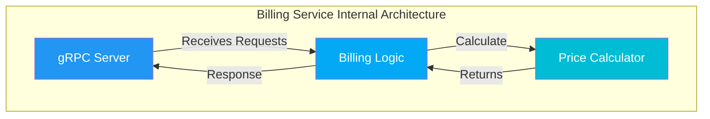

#### 📦 Dependencies & Build

Uses the same gRPC dependencies and build configuration as the Patient Service (see above).

---

### Notification Service

Processes events from Kafka and sends notifications to users.

#### Service Architecture

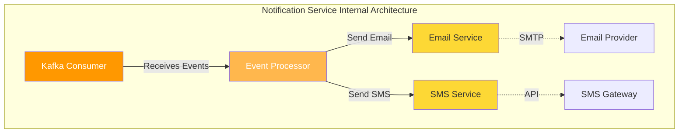

#### 📦 Environment Variables

```bash
SPRING_KAFKA_BOOTSTRAP_SERVERS=kafka:9092
```

#### 🔧 Maven Dependencies

```xml
<dependencies>
    <!-- Kafka Support -->
    <dependency>
        <groupId>org.springframework.kafka</groupId>
        <artifactId>spring-kafka</artifactId>
        <version>3.3.0</version>
    </dependency>

    <!-- Protocol Buffers -->
    <dependency>
        <groupId>com.google.protobuf</groupId>
        <artifactId>protobuf-java</artifactId>
        <version>4.29.1</version>
    </dependency>
</dependencies>
```

#### 🏗️ Build Configuration

```xml
<build>
    <extensions>
        <extension>
            <groupId>kr.motd.maven</groupId>
            <artifactId>os-maven-plugin</artifactId>
            <version>1.7.0</version>
        </extension>
    </extensions>
    
    <plugins>
        <plugin>
            <groupId>org.springframework.boot</groupId>
            <artifactId>spring-boot-maven-plugin</artifactId>
        </plugin>

        <plugin>
            <groupId>org.xolstice.maven.plugins</groupId>
            <artifactId>protobuf-maven-plugin</artifactId>
            <version>0.6.1</version>
            <configuration>
                <protocArtifact>com.google.protobuf:protoc:3.25.5:exe:${os.detected.classifier}</protocArtifact>
                <pluginId>grpc-java</pluginId>
                <pluginArtifact>io.grpc:protoc-gen-grpc-java:1.68.1:exe:${os.detected.classifier}</pluginArtifact>
            </configuration>
            <executions>
                <execution>
                    <goals>
                        <goal>compile</goal>
                        <goal>compile-custom</goal>
                    </goals>
                </execution>
            </executions>
        </plugin>
    </plugins>
</build>
```

---

### Auth Service

Provides JWT-based authentication and authorization for the system.

#### Service Architecture

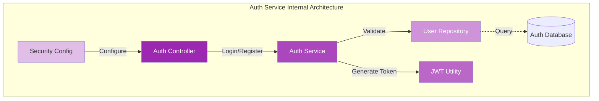

#### 📦 Environment Variables

```bash
# Database Configuration
SPRING_DATASOURCE_URL=jdbc:postgresql://auth-service-db:5432/db
SPRING_DATASOURCE_USERNAME=admin_user
SPRING_DATASOURCE_PASSWORD=password
SPRING_JPA_HIBERNATE_DDL_AUTO=update
SPRING_SQL_INIT_MODE=always
```

#### 🔧 Maven Dependencies

```xml
<dependencies>
    <!-- Spring Security -->
    <dependency>
        <groupId>org.springframework.boot</groupId>
        <artifactId>spring-boot-starter-security</artifactId>
    </dependency>

    <!-- Spring Data JPA -->
    <dependency>
        <groupId>org.springframework.boot</groupId>
        <artifactId>spring-boot-starter-data-jpa</artifactId>
    </dependency>

    <!-- Spring Web -->
    <dependency>
        <groupId>org.springframework.boot</groupId>
        <artifactId>spring-boot-starter-web</artifactId>
    </dependency>

    <!-- JWT Support -->
    <dependency>
        <groupId>io.jsonwebtoken</groupId>
        <artifactId>jjwt-api</artifactId>
        <version>0.12.6</version>
    </dependency>
    <dependency>
        <groupId>io.jsonwebtoken</groupId>
        <artifactId>jjwt-impl</artifactId>
        <version>0.12.6</version>
        <scope>runtime</scope>
    </dependency>
    <dependency>
        <groupId>io.jsonwebtoken</groupId>
        <artifactId>jjwt-jackson</artifactId>
        <version>0.12.6</version>
        <scope>runtime</scope>
    </dependency>

    <!-- Database Drivers -->
    <dependency>
        <groupId>org.postgresql</groupId>
        <artifactId>postgresql</artifactId>
        <scope>runtime</scope>
    </dependency>
    <dependency>
        <groupId>com.h2database</groupId>
        <artifactId>h2</artifactId>
    </dependency>

    <!-- API Documentation -->
    <dependency>
        <groupId>org.springdoc</groupId>
        <artifactId>springdoc-openapi-starter-webmvc-ui</artifactId>
        <version>2.6.0</version>
    </dependency>

    <!-- Testing -->
    <dependency>
        <groupId>org.springframework.boot</groupId>
        <artifactId>spring-boot-starter-test</artifactId>
        <scope>test</scope>
    </dependency>
    <dependency>
        <groupId>org.springframework.security</groupId>
        <artifactId>spring-security-test</artifactId>
        <scope>test</scope>
    </dependency>
</dependencies>
```

#### 💾 Database Initialization

Create `src/main/resources/data.sql`:

```sql
-- Create users table
CREATE TABLE IF NOT EXISTS "users" (
    id UUID PRIMARY KEY,
    email VARCHAR(255) UNIQUE NOT NULL,
    password VARCHAR(255) NOT NULL,
    role VARCHAR(50) NOT NULL
);

-- Insert default admin user (password: test123)
INSERT INTO "users" (id, email, password, role)
SELECT 
    '223e4567-e89b-12d3-a456-426614174006',
    'testuser@test.com',
    '$2b$12$7hoRZfJrRKD2nIm2vHLs7OBETy.LWenXXMLKf99W8M4PUwO6KB7fu',
    'ADMIN'
WHERE NOT EXISTS (
    SELECT 1 FROM "users"
    WHERE id = '223e4567-e89b-12d3-a456-426614174006'
       OR email = 'testuser@test.com'
);
```

> **Default Credentials:**  
> Email: `testuser@test.com`  
> Password: `test123`

---

## 🏗️ Infrastructure Components

### Kafka Architecture

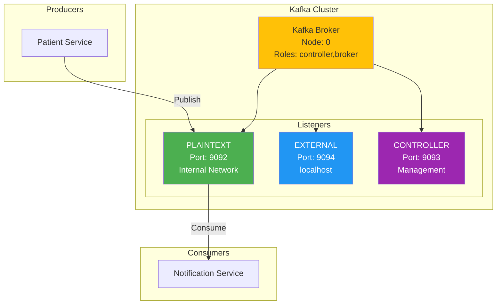

#### 🐳 Docker Environment Variables

For IntelliJ IDEA container configuration:

```bash
KAFKA_CFG_ADVERTISED_LISTENERS=PLAINTEXT://kafka:9092,EXTERNAL://localhost:9094
KAFKA_CFG_CONTROLLER_LISTENER_NAMES=CONTROLLER
KAFKA_CFG_CONTROLLER_QUORUM_VOTERS=0@kafka:9093
KAFKA_CFG_LISTENER_SECURITY_PROTOCOL_MAP=CONTROLLER:PLAINTEXT,EXTERNAL:PLAINTEXT,PLAINTEXT:PLAINTEXT
KAFKA_CFG_LISTENERS=PLAINTEXT://:9092,CONTROLLER://:9093,EXTERNAL://:9094
KAFKA_CFG_NODE_ID=0
KAFKA_CFG_PROCESS_ROLES=controller,broker
```

#### 📡 Port Mapping

| Listener | Port | Purpose | Access |
|----------|------|---------|--------|
| PLAINTEXT | 9092 | Internal service communication | Docker network |
| EXTERNAL | 9094 | External testing/debugging | localhost |
| CONTROLLER | 9093 | Cluster management | Internal only |

---

### Database Architecture

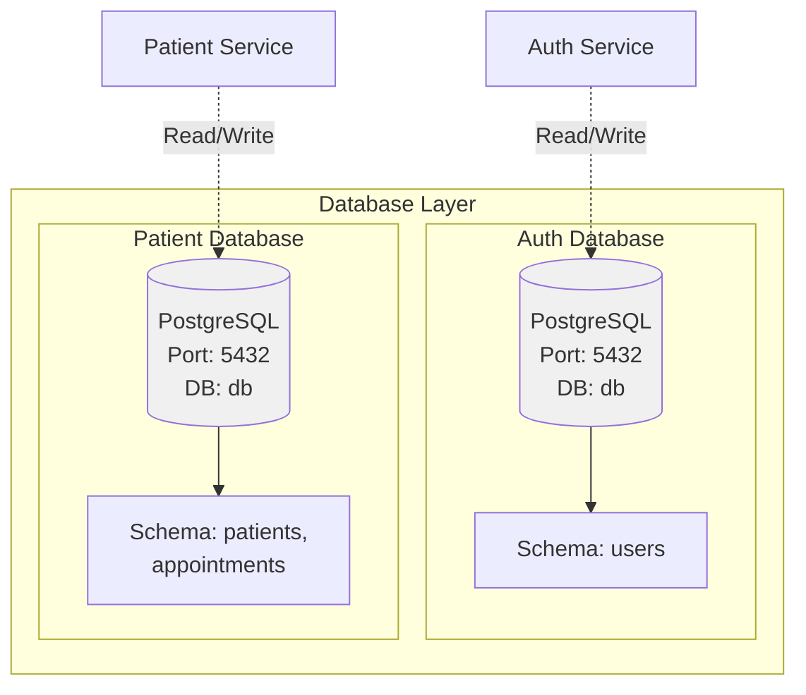

#### Auth Service Database

```bash
POSTGRES_DB=db
POSTGRES_USER=admin_user
POSTGRES_PASSWORD=password
```

**Container hostname:** `auth-service-db`  
**Port:** `5432`

---

## 🔄 Complete Request Flow Example

### Creating a Patient with Billing

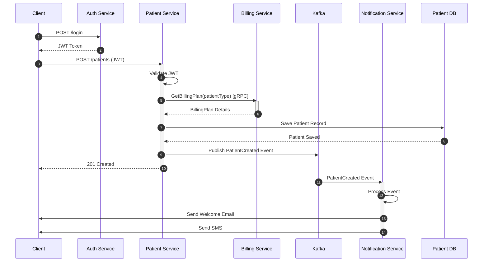

---

## 🚀 Getting Started

### Prerequisites

- ☕ Java 17+
- 📦 Maven 3.8+
- 🐳 Docker & Docker Compose
- 💻 IntelliJ IDEA (recommended)

### Deployment Architecture

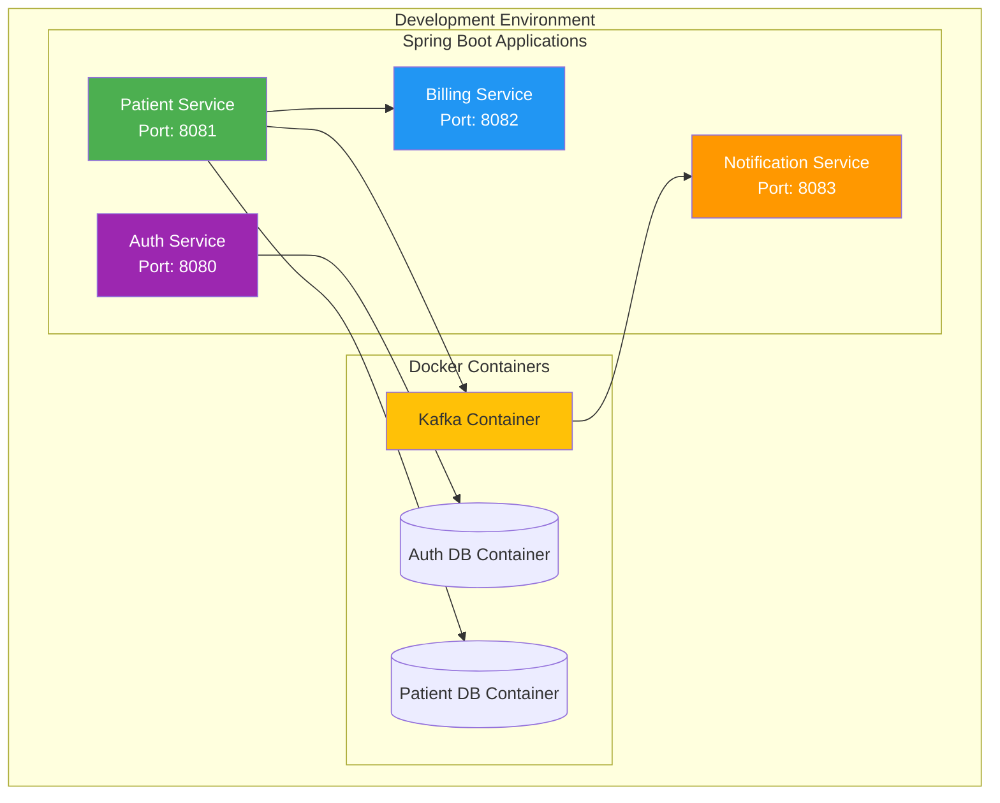

### Quick Start

1. **Clone the repository**
   ```bash
   git clone <repository-url>
   cd <project-directory>
   ```

2. **Start infrastructure services**
   ```bash
   docker-compose up -d
   ```

3. **Build all services**
   ```bash
   mvn clean install
   ```

4. **Run services**
   - Start each service individually using your IDE
   - Or use Maven: `mvn spring-boot:run`

5. **Verify setup**
   - Auth Service: `http://localhost:8080`
   - Patient Service: `http://localhost:8081`
   - Billing Service: `http://localhost:8082` (gRPC)
   - Notification Service: `http://localhost:8083`
   - API Documentation: `http://localhost:8080/swagger-ui.html`

### Service Startup Order


---

## 📊 Monitoring & Observability

### Health Check Endpoints

| Service | Endpoint | Port |
|---------|----------|------|
| Auth Service | `/actuator/health` | 8080 |
| Patient Service | `/actuator/health` | 8081 |
| Billing Service | `/actuator/health` | 8082 |
| Notification Service | `/actuator/health` | 8083 |

---

## 📚 Additional Resources

- [Spring Boot Documentation](https://spring.io/projects/spring-boot)
- [gRPC Java Documentation](https://grpc.io/docs/languages/java/)
- [Apache Kafka Documentation](https://kafka.apache.org/documentation/)
- [Protocol Buffers Guide](https://protobuf.dev/)

---

## 📄 License

This project is licensed under the MIT License - see the LICENSE file for details.

---

## 🤝 Contributing

Contributions are welcome! Please feel free to submit a Pull Request.

---

**Built with ❤️ by Prahlad-7**
